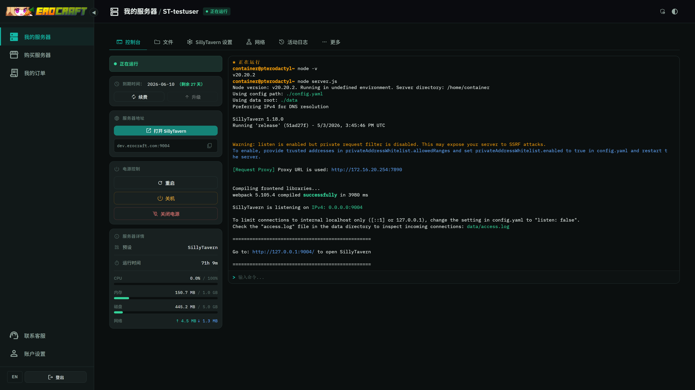

# 艾萝工坊运维管理系统

**中文** · [English](README.md)



以 Wings 为唯一运行时依赖的服务器租赁管理平台。提供面向终端用户的控制台 / 文件 / 计费 / 注册 / 续费界面，以及管理员侧的服务器、用户、节点、证书、告警与计费控制台。

---

## 一、介绍

### 1.1 软件构成

本仓库提供两个独立可部署单元：

| 单元 | 位置 | 作用 |
|---|---|---|
| Manager | 仓库根目录 | 后端 API + 后台任务 + Vue SPA。部署在主机 A。 |
| Agent | `agent/` | 节点宿主机指标采集 / 探针 / 证书部署 / Wings 服务控制。部署在每台节点机器上。 |

Manager 后端由两个进程组成：

- `manager-web`：FastAPI + Uvicorn，监听 `:5001`，提供 REST API 与控制台 WebSocket。
- `manager-jobs`：APScheduler，独立进程，跑监控采集 / 自动暂停 / 自动删除 / 续签等定时任务。

两进程共享 `app/` 代码与同一份数据库连接，但独立运行。

### 1.2 外部依赖

**运行时硬依赖** ：

| 依赖 | 用途 |
|---|---|
| Wings | 容器生命周期、电源、控制台、文件（在每个节点上，Manager 直接调用 `:8443` HTTPS 与控制台 WS） |
| MySQL / MariaDB | 唯一数据存储。Manager 自己的表以 `manager_` 前缀创建；Wings 需要的 server / node 记录也存于同库 |
| nginx | 对外反向代理，同时承载 SPA 静态文件与 API 反代 |
| acme.sh | 证书签发 / 续签，由 Manager 后台调用 CLI |

**与 Pterodactyl Panel 的关系**：Manager 运行时独立于 Panel 进程，仅通过数据库与 Wings 交互。Manager 使用的数据库表名 / 列与 Wings `daemon_token` 的 Laravel 加密格式是 Wings 生态的事实上的约定。环境中可同时部署 Pterodactyl Panel，两者共用同一库，Panel 的管理面可作为底层应急手段保留；仅部署 Manager 时，需自行完成表结构初始化与与 Wings 的密钥对齐。

### 1.3 进程拓扑

```
            浏览器
              │
              ↓
         nginx :80/:443
              │
   ┌──────────┴───────────┐
   │                      │
   ↓                      ↓
SPA (静态文件)      manager-web :5001  ──直读/写──→  MySQL
                          │
                          ├──HTTPS──→  Wings :8443    （每个节点）
                          │
                          └──HTTPS──→  Agent :48765   （每个节点）
                          ↑
                          │
                manager-jobs (APScheduler)  ─── 定时拉取 Agent / 跑自动化
```

### 1.4 技术栈

| 层 | 选型 |
|---|---|
| 后端 | Python 3.12, FastAPI, SQLAlchemy 2 (async), Pydantic v2, APScheduler, Alembic |
| 前端 | Vue 3.5, Vite 6, TypeScript, vue-i18n, ECharts, xterm.js, CodeMirror 6 |
| 数据库 | MySQL / MariaDB |
| Agent | Python 3 + FastAPI + psutil + httpx |
| 证书 | acme.sh |

### 1.5 仓库结构

```
app/                FastAPI 后端代码
  api/routers/      HTTP 路由
  services/         业务逻辑（panel_db, wings, agent_client, cert_manager, billing, ...）
  jobs/             manager-jobs 入口与调度配置
  schemas/          Pydantic 模型
  db/               ORM 模型 + AsyncSession
  core/             配置、安全、时间工具
agent/              节点 Agent 源码
alembic/            数据库迁移脚本
frontend/           Vue 3 SPA
docs/               架构与设计文档（ARCHITECTURE_V3 是权威）
templates/          邮件模板 JSON
manager.sh          后端服务管理脚本
.env.example        环境变量模板
```

---

## 二、部署

### 2.1 前置条件

- Linux x86_64（Debian 12 / Ubuntu 22.04+ 验证通过）
- 至少一台 Wings 节点与一个可访问的 MySQL / MariaDB 实例（表结构遵从 Wings 生态约定，通常由 Pterodactyl Panel 初始化）
- Python 3.12+、Node.js 20+、nginx
- 主机 A 能访问上述 MySQL（同机或跨机均可）
- acme.sh 已安装

### 2.2 Manager 后端

```bash
sudo mkdir -p /opt/erocraft_manager
sudo chown $USER:$USER /opt/erocraft_manager
git clone https://github.com/vvb7456/Erocraft_Manager.git /opt/erocraft_manager
cd /opt/erocraft_manager

python3.12 -m venv venv
venv/bin/pip install --upgrade pip
venv/bin/pip install -r requirements.txt

cp .env.example .env
$EDITOR .env
```

`.env` 中**必须填写**：

| 变量 | 说明 |
|---|---|
| `SECRET_KEY` | ≥32 字符。`python -c "import secrets; print(secrets.token_hex(32))"` 生成 |
| `DB_HOST` / `DB_PORT` / `DB_USER` / `DB_PASSWORD` / `DB_NAME` | 数据库连接 |
| `PANEL_APP_KEY` | Wings 生态使用的 Laravel `APP_KEY`。用于解密 `nodes.daemon_token` 等字段；若与 Pterodactyl Panel 共库，必须与 Panel `.env` 中 `APP_KEY` 完全一致 |
| `CERT_ACME_SH_HOME` | acme.sh 安装目录 |
| `CERT_ACME_SH_BIN` | acme.sh 可执行文件路径 |

启动：

```bash
bash manager.sh start          # 同时启动 web + jobs，启动前自动跑 alembic upgrade head
bash manager.sh status
```

进程产物：`erocraft_manager_web.pid`、`erocraft_manager_jobs.pid`。日志位于 `logs/`。

### 2.3 前端

```bash
cd frontend
npm ci
npx vite build           # 输出 ../static/dist/
bash build-fonts.sh      # 重建 Material Symbols 子集字体
```

### 2.4 nginx

最小可用配置（HTTPS 自行追加 `listen 443 ssl;` 与证书路径）：

```nginx
server {
    listen 80;
    server_name panel.example.com;

    # 证书部署接口耗时较长
    location /api/admin/certificates {
        proxy_pass http://127.0.0.1:5001;
        proxy_set_header Host $host;
        proxy_set_header X-Forwarded-For $proxy_add_x_forwarded_for;
        proxy_set_header X-Forwarded-Proto $scheme;
        proxy_read_timeout 400s;
    }

    # API + 控制台 WS
    location /api/ {
        proxy_pass http://127.0.0.1:5001;
        proxy_http_version 1.1;
        proxy_set_header Upgrade $http_upgrade;
        proxy_set_header Connection "upgrade";
        proxy_set_header Host $host;
        proxy_set_header X-Forwarded-For $proxy_add_x_forwarded_for;
        proxy_set_header X-Forwarded-Proto $scheme;
        proxy_read_timeout 120s;
    }

    location / {
        root /opt/erocraft_manager/static/dist;
        try_files $uri /index.html;
    }
}
```

### 2.5 节点 Agent

每台 Wings 节点都需要装 Agent，运行目录约定为 `/opt/erocraft-agent`（与仓库内 `agent/` 区分）。

```bash
sudo mkdir -p /opt/erocraft-agent
cd /opt/erocraft-agent
python3 -m venv venv
venv/bin/pip install -r /path/to/erocraft_manager/agent/requirements.txt
sudo cp -r /path/to/erocraft_manager/agent ./agent

sudo cp agent/config.example.yaml ./agent.yaml
sudo $EDITOR ./agent.yaml
```

`agent.yaml` 关键字段：

| 字段 | 含义 |
|---|---|
| `agent.role` | `wings_node` / `generic_host` / `synology_dsm` |
| `agent.bind` | 监听地址，默认 `0.0.0.0:48765` |
| `agent.token` | Bearer Token；高强度随机串。Manager 侧加密存储 |
| `agent.allow_ips` | 可选。源 IP 白名单 |
| `wings.config_path` | `wings_node` 模式下指向 wings 配置 |

systemd：

```bash
sudo cp agent/erocraft-agent.service /etc/systemd/system/
sudo systemctl daemon-reload
sudo systemctl enable --now erocraft-agent
```

接入：在 Manager 后台 → 主机管理 → 新增，填 endpoint URL（`http://<node>:48765`）和 token，保存后会自动 probe。

### 2.6 Agent 增量部署

修改仓库内 `agent/` 后，需手动推送并重启运行中的 agent：

```bash
bash scripts/deploy-agent.sh              # 部署到本机
bash scripts/deploy-agent.sh <node-host>  # 部署到远程节点
```

### 2.7 数据库迁移

启动脚本会自动执行迁移。手动操作：

```bash
venv/bin/alembic -c alembic.ini current
venv/bin/alembic -c alembic.ini history
venv/bin/alembic -c alembic.ini upgrade head
venv/bin/alembic -c alembic.ini revision --autogenerate -m "..."
```

Manager 自有表全部以 `manager_` 前缀，迁移脚本仅作用于这些表。

---

## 三、运维

### 3.1 服务管理

```bash
bash manager.sh start | stop | restart | status            # web + jobs
bash manager.sh start-web | stop-web | status-web
bash manager.sh start-jobs | stop-jobs | status-jobs
```

启动先跑 `alembic upgrade head`；迁移失败时查看 `logs/manager-web.log`。

### 3.2 日志

| 文件 / 命令 | 内容 |
|---|---|
| `logs/manager-web.log` | uvicorn 访问 + 应用日志 |
| `logs/manager-jobs.log` | 定时任务日志 |
| `journalctl -u erocraft-agent` | 节点 Agent |
| `journalctl -u wings` | Wings |

日志级别由 `.env` 的 `LOG_LEVEL` 控制（`DEBUG / INFO / WARNING / ERROR`）。

### 3.3 定时任务

`manager-jobs` 周期性执行：

| 任务 | 触发 | 来源 |
|---|---|---|
| 监控采集（拉取所有 host agent 指标） | 每 `MONITOR_INTERVAL_SEC` 秒（默认 60） | `.env` + 运行时设置 |
| 监控数据清理 | 每日 | `MONITOR_RETENTION_DAYS`（默认 30 天） |
| 自动暂停 / 删除 / 提醒邮件 | 每日 `AUTOMATION_RUN_HOUR:MINUTE` | 运行时设置可覆盖 |
| 证书续签与到期告警 | 每日 | acme.sh + 后台扫描 |

`.env` 仅作为首启 fallback，运行时配置以数据库（管理员后台「设置」页）为准。

### 3.4 证书

- **来源**：扫描 `CERT_ACME_SH_HOME` 目录 + acme.sh 元数据
- **续签**：调用 `CERT_ACME_SH_BIN`
- **部署目标**：本机文件 / 远程 nginx（经 Agent 写入并 reload）/ Synology DSM API
- **Webhook**：acme.sh `reloadcmd` 或 `deploy hook` 回调 `/api/public/cert-webhook`，需配置 `CERT_WEBHOOK_TOKEN`
- **告警**：`CERT_ALERT_EMAIL_ADMIN_IDS` 指定接收人，可在「设置」中改

### 3.5 主机 / 节点维护

| 操作 | 路径 |
|---|---|
| 新增节点 | 后台 → 主机管理 → 新增（填 endpoint + token） |
| 编辑 Wings 配置 | 主机详情 → Wings 标签；保存后 Manager 写 `nodes` 表并 push 到 wings `/api/update` |
| 重启 Wings | 主机详情 → Wings → 重启（经 Agent 触发 `systemctl restart wings`） |
| 端口分配 | 主机详情 → 分配 标签 |
| 告警阈值 | 主机详情 → 设置 标签（per-host 覆盖全局默认） |

### 3.6 备份

| 项目 | 命令 / 路径 |
|---|---|
| 数据库 | `mysqldump <DB_NAME> > db.sql` |
| 配置 | `.env`、`agent.yaml`（每节点）、nginx 站点文件 |
| 证书 | 整个 `CERT_ACME_SH_HOME` |
| 容器卷 | 节点上的 `/var/lib/pterodactyl/volumes` |

### 3.7 升级

```bash
cd /opt/erocraft_manager
git pull
venv/bin/pip install -r requirements.txt
cd frontend && npm ci && npx vite build && cd ..
bash manager.sh restart                     # 自动迁移
bash scripts/deploy-agent.sh                # 仅 agent/ 有变更时
```

### 3.8 故障排查速查

| 现象 | 排查方向 |
|---|---|
| `manager.sh start` 即时失败 | `logs/manager-web.log`；常见为 `.env` 必填项缺失或迁移失败 |
| 用户控制台连不上 | 检查 nginx 是否转发 `Upgrade/Connection` 头；检查 wings `:8443` 对 Manager 的连通性 |
| 监控无数据 | 主机详情 → 设置 → Probe；`systemctl status erocraft-agent`；核对 token 一致性 |
| 证书未续签 | `logs/manager-jobs.log` 搜 `cert`；手动 `${CERT_ACME_SH_BIN} --renew -d <domain> --force` |
| 创建服务器失败 | `logs/manager-web.log` 中 `lifecycle` 日志；失败会自动补偿回滚 |
| Panel 字段解密报错 | 确认 `PANEL_APP_KEY` 与 Wings 生成 `daemon_token` 时使用的 `APP_KEY` 一致（同库部署 Pterodactyl Panel 时，即 Panel `.env` 中 `APP_KEY`） |

### 3.9 常用命令

```bash
venv/bin/alembic -c alembic.ini current                      # 当前迁移版本
tail -f logs/manager-jobs.log                                # 跟踪任务日志
curl -fsS http://127.0.0.1:5001/api/version                  # 健康检查
```

---

## 许可证

见 [LICENSE](LICENSE)。
